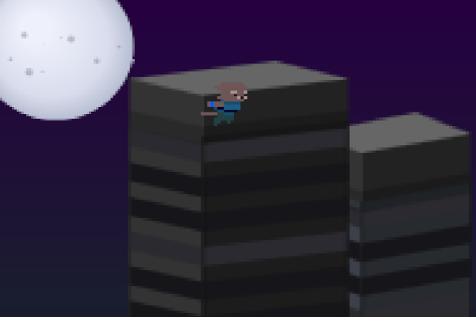

  

# FLYKT 𓆩₍^. .^₎𓆪 

  A physics-based platformer where you <i>flick</i> a <b>black cat</b> through portals to help it <i>escape</i>.

  <b>/flɪkt/ — An international homograph with two equal and distinct meanings:</b> 
  <i>n.</i> <b>1.</b> &#x1F1F8;&#x1F1EA; <i>Escape, Flight, Getaway</i> 
  <i>v.</i> <b>2.</b> &#x1F1EC;&#x1F1E7; <i>To be propelled; launched with a swift, sharp motion</i>

  <a href="https://js13kgames.com"><strong>A 2025 js13k game jam entry »</strong></a>

---

## 🎮 Controls

- **Left Click**: Shoot blue portal  
- **Right Click**: Shoot orange portal  
- **Space** (hold): Jump  
- **W/↑**: Increase jump power  
- **S/↓**: Decrease jump power  
- **A/←**: Point jump to left  
- **D/→**: Point jump to right  

---

## Nerd Stuff

### Core Systems
- **Portal System** – Raycasting, velocity transformation, cooldown management  
- **Physics Engine** – Custom collisions and inertia  
- **Camera System** – EMA smoothing with safe zones and pixel snapping  
- **Audio Engine** – ZzFX-based sound generator for SFX  
- **Music** – Custom ZzFXM songs composed for a small form factor  
- **Scene Management** – State machine with transition support  
- **Level Data** – Support for Tiled map editor  