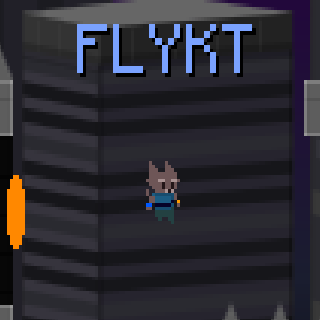

  

# FLYKT 𓆩₍^. .^₎𓆪 

A physics platformer that's all about solving levels using momentum, portals, and precise movement. Aim, charge, and fire a black cat through interesting puzzles across city rooftops and alleyways. Can you solve them all?

# How to play

Aim: hold <kbd>Space</kbd> on ground, Aim with <kbd>A</kbd> + <kbd>D</kbd>  release <kbd>Space</kbd> to launch.

Portals: <kbd>Mouse Left</kbd> = A, <kbd>Mouse Right</kbd> = B

Reset current level: <kbd>R</kbd>

  <a href="https://js13kgames.com"><strong>A 2025 js13k game jam entry »</strong></a>

---

## 🎮 Controls

- **Left Click**: Shoot blue portal  
- **Right Click**: Shoot orange portal  
- **Space** (hold): Jump  
- **W/↑**: Increase jump power  
- **S/↓**: Decrease jump power  
- **A/←**: Point jump to left  
- **D/→**: Point jump to right  

